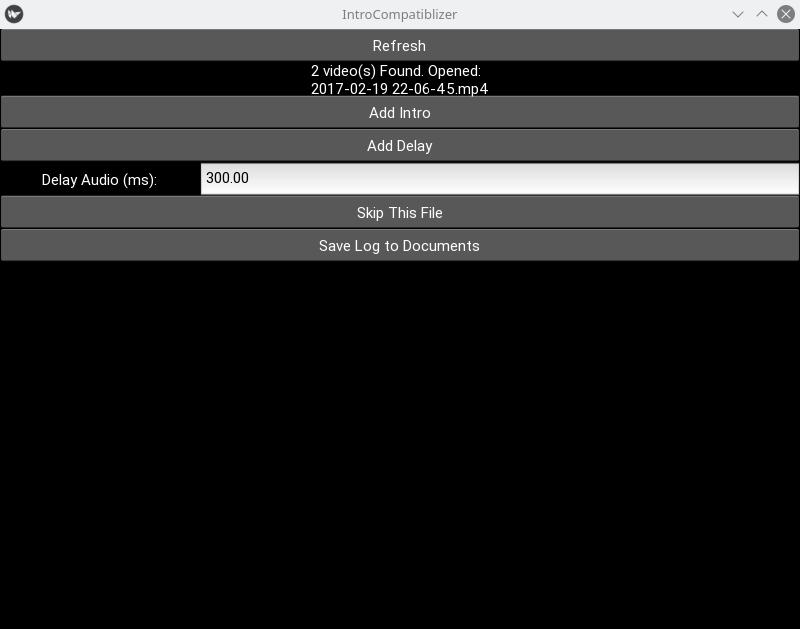
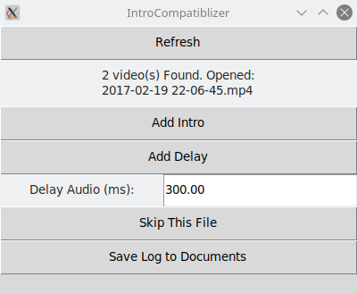

# kivy-tkinter
Run some simple Kivy and KV code purely using the Tkinter framework!

Only some simple widgets are implemented so far.


## Usage
Link or copy the kivy-tkinter/kivy directory into your app.

To link:
```
# set APP_DIR to your app's directory before running this code.
mkdir -p ~/git
cd ~/git && git clone https://github.com/poikilos/kivy-tkinter kivy-tkinter
cd $APP_DIR
ln -s ~/git/kivy-tkinter/kivy
```

Then run your app on a system or virtualenv that does not have Kivy, or
otherwise coerce Python to use the directory above rather than your
Kivy. If you aren't sure which is running, see the differences in the
theme as seen in the screenshots.

### Troubleshooting
- Doesn't Open

  If the app doesn't open, try running it from a command line interface
  to see the output.

- `NotImplementedError` (and most cases of `AttributeError` that don't
  occur when you run your code in Kivy):

  There is much to do to implement features like InstructionGroup,
  ListAdapter, and formats (images, videos etc), so if you need a
  feature like that, chances are you will have to code it yourself.
  Please submit changes in the form of a pull request due to the amount
  of work necessary to make this project "complete". I hope you enjoy
  this and contribute so that we can improve this project together.


## Examples
Kivy programs need no code changes to utilize kivy-tkinter! However,
only so many features of Kivy are implemented. Known working Kivy
apps include:

### [IntroCompatiblizer](https://github.com/poikilos/IntroCompatiblizer)

#### Before (Kivy)


#### After (kivy-tkinter)



## Links
- [kivy-tkinter on Reddit](https://www.reddit.com/r/kivy/comments/kqh0gl/kivytkinter_a_wip_compatibility_layer_to_run_kivy/)
- [kivy-tkinter on kivy-users](https://groups.google.com/g/kivy-users/c/um19B__0ArU) on Google Groups
- [poikilos.org](https://poikilos.org) dev blog
- [kivy-tkinter on kivy/your-projects](https://discord.com/channels/423249981340778496/498526835337068581/795768163932569652) on Discord
